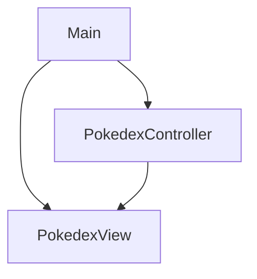

# Pokedex

Este proyecto es una simulación de una **Pokedex** por consola, desarrollada en Java. El objetivo principal es demostrar la separación de responsabilidades mediante el patrón de diseño **Modelo-Vista-Controlador (MVC)**, permitiendo un código más limpio, escalable y fácil de mantener.

## Arquitectura del Proyecto

El código está estructurado bajo el patrón **MVC (Modelo-Vista-Controlador)**, dividido en los siguientes paquetes:

* **es.etg.prog.pokedex**: Contiene la clase `Main` (punto de entrada del programa).
* **es.etg.prog.pokedex.controller**: Contiene la lógica de control (`PokedexController`) que gestiona el flujo entre el usuario y los datos.
* **es.etg.prog.pokedex.view**: Contiene la interfaz de usuario (`PokedexView`), encargada de mostrar menús y capturar entradas por teclado.

## Diagrama de Estructura

A continuación se muestra cómo interactúan las clases entre sí:

